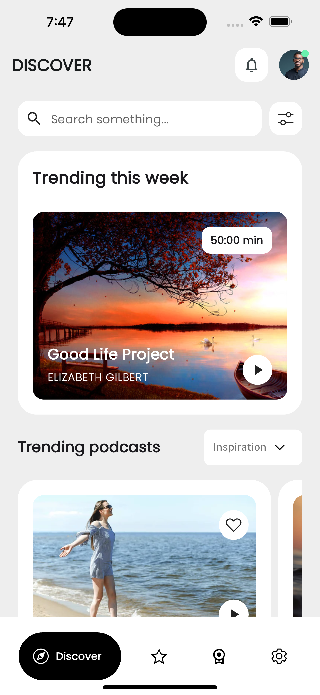
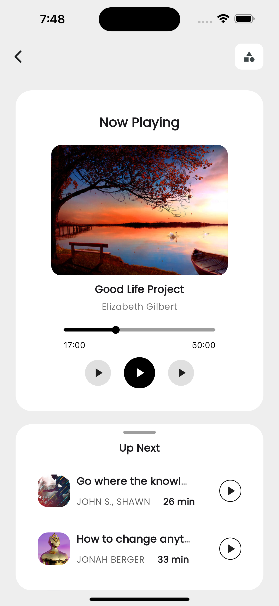
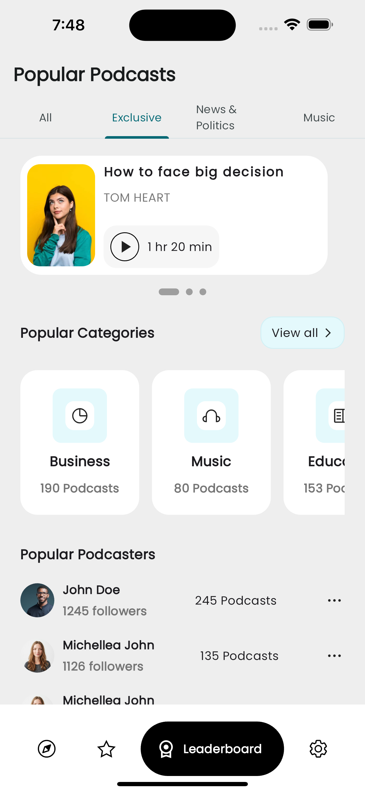

---

# Podcast App UI - Flutter

This project is a Flutter-based practice project where I replicated the UI design of a podcast app inspired by a design from [Dribbble](https://dribbble.com/shots/24316041-Podcast-mobile-version). The goal of this project was to practice my Flutter UI development skills by creating a pixel-perfect replica of the provided design.

## Table of Contents

- [Overview](#overview)
- [Screenshots](#screenshots)
- [Getting Started](#getting-started)
- [Installation](#installation)
- [Acknowledgements](#acknowledgements)

## Overview

This project demonstrates the following:
- Implementation of custom UI elements
- Use of Flutter widgets to create responsive and attractive layouts
- Navigation between different screens
- Integration of animations for a smooth user experience

## Screenshots

Here are some screenshots of the app:

<p float="left">
  
   
   
</p>

## Getting Started

These instructions will help you set up the project on your local machine for development and testing purposes.

### Prerequisites

- Flutter SDK: [Installation Guide](https://flutter.dev/docs/get-started/install)
- Dart SDK
- A code editor like VS Code or Android Studio

### Installation

1. Clone the repository:
   ```sh
   git clone https://github.com/upretisaurav/podcast-app-ui-flutter.git
   cd podcast-app-ui-flutter
   ```

2. Install the dependencies:
   ```sh
   flutter pub get
   ```

### Usage

To run the app on an emulator or physical device, use the following command:
```sh
flutter run
```

## Acknowledgements

- [Dribbble](https://dribbble.com/shots/24316041-Podcast-mobile-version) for the design inspiration.
- The Flutter team for providing an excellent framework.

---