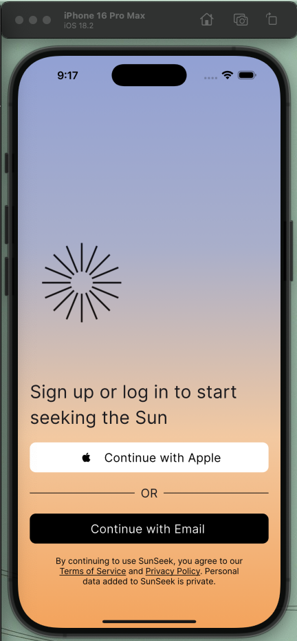
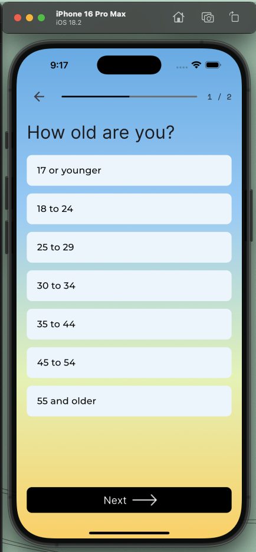
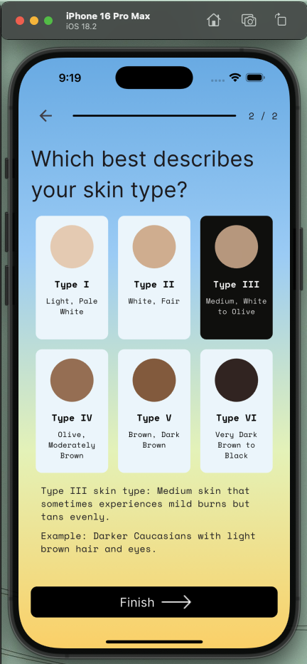

# SunSeek - Health & Wellness Onboarding Flow

> **Design Credit**: This Flutter implementation is based on the ["Onboarding Flow for SunSeek - Streamlined User Journey for Health"](https://dribbble.com/shots/25461993-Onboarding-Flow-for-SunSeek-Streamlined-User-Journey-for-Health) design created by [Igor Savelev](https://dribbble.com/igorsavelev). The original design can be found on Dribbble. All design rights and creative elements belong to the original creator.

A Flutter implementation that brings to life the elegant onboarding experience designed by Igor Savelev. This project aims to faithfully reproduce the original design's aesthetics and interactions while showcasing Flutter's capabilities.

## 📱 Preview

The app features a three-screen onboarding flow with smooth transitions and engaging visuals:

<p float="left">
  
   
   
</p>

## ✨ Features

- Smooth page transitions with PageView
- Custom animated indicators
- Responsive design that adapts to different screen sizes
- Modern, clean UI following Material Design 3 principles
- Gesture-based navigation
- Progress-aware CTA buttons

## 🛠️ Technical Implementation

### Dependencies

```yaml
name: sunseek_ui
description: "A new Flutter project."
publish_to: "none"
version: 0.1.0

environment:
  sdk: ^3.6.0

dependencies:
  flutter:
    sdk: flutter
  google_fonts: ^6.2.1

dev_dependencies:
  flutter_lints: ^5.0.0
  flutter_test:
    sdk: flutter

flutter:
  uses-material-design: true
  assets:
    - assets/img/
```

### Project Structure

```
lib/
├── main.dart
├── src/
│   ├── config/
│   │   ├── constants/
│   │   │   ├── assets.dart
│   │   │   ├── colors.dart
│   │   │   └── strings.dart
│   │   └── theme/
│   │       └── app_text_styles.dart
│   └── screens/
│       ├── age_selection_screen.dart
│       ├── landing_screen.dart
│       ├── onboarding_screen.dart
│       └── skin_type_screen.dart
│   └── widgets/
│       ├── age_card.dart
│       ├── custom_button.dart
│       ├── custom_vertical_card.dart
│       ├── onboarding_background.dart
│       └── onboarding_header.dart
```

## 🚀 Getting Started

1. Clone the repository:

```bash
git clone https://github.com/upretisaurav/sunseek-flutter.git
```

2. Install dependencies:

```bash
flutter pub get
```

3. Run the app:

```bash
flutter run
```

## 🤝 Contributing

Contributions, issues, and feature requests are welcome!

## 📫 Contact

Project Link: [https://github.com/upretisaurav/sunseek-flutter](https://github.com/upretisaurav/sunseek-flutter)
